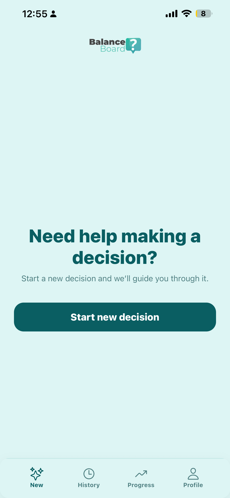
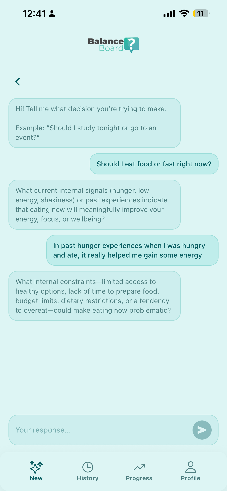
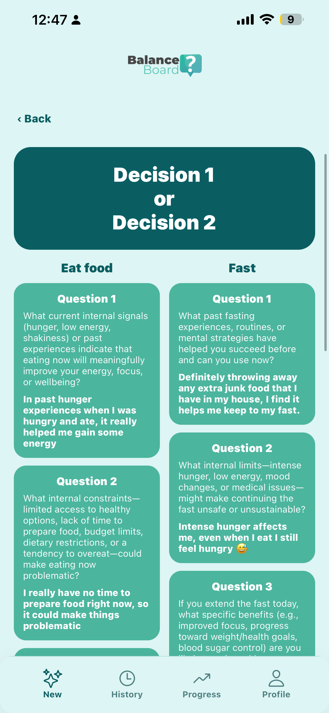
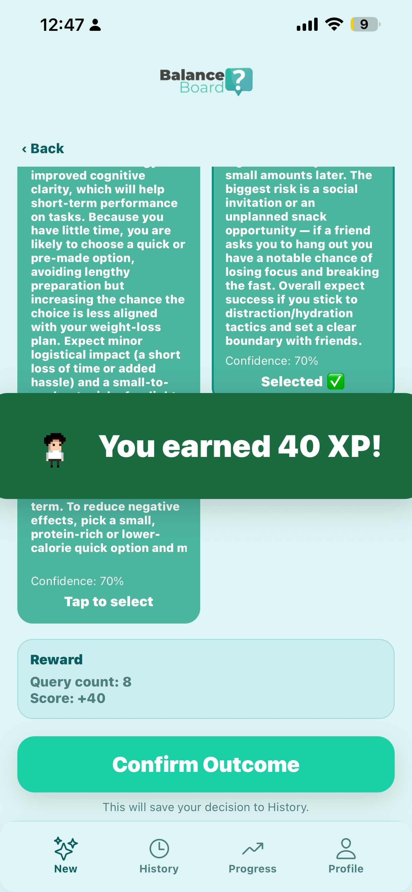
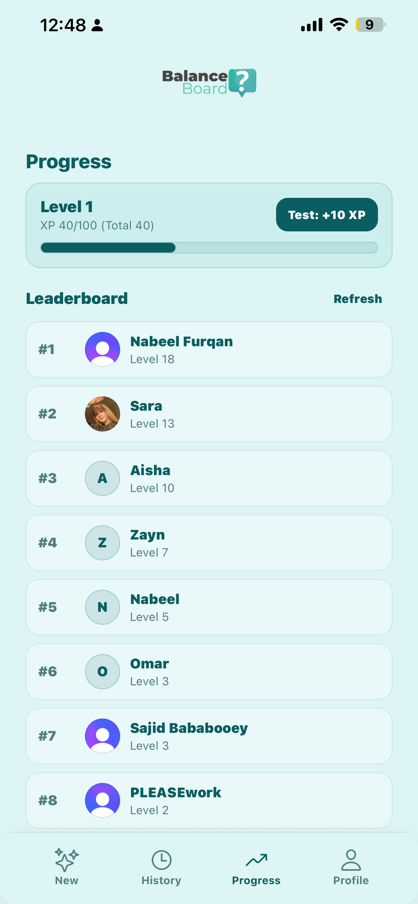
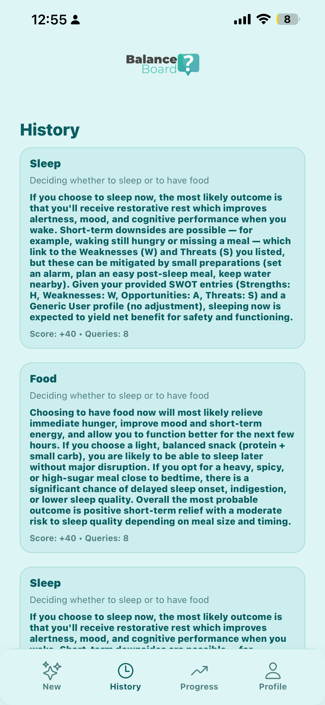
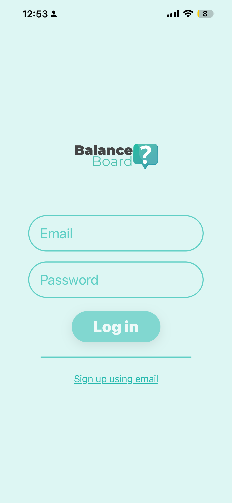
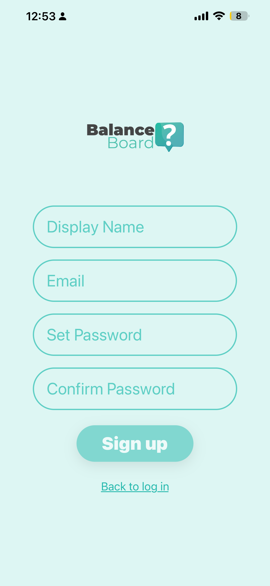
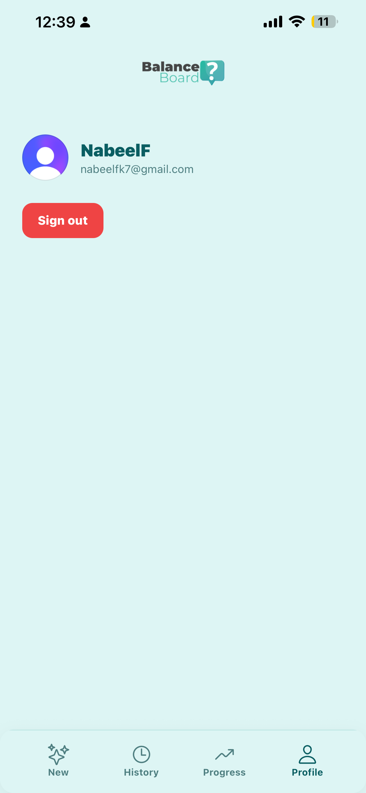

# 🧠 Balance Board  
### A Smart Decision-Making Companion

**Balance Board** is an AI-powered decision-making assistant designed to help users approach complex choices with structure, clarity, and confidence.

Rather than functioning as a generic chatbot, Balance Board guides users through a structured analytical process that incorporates adaptive questioning, SWOT analysis, probabilistic outcome modeling, and a gamified progression system that rewards thoughtful reflection.

Built as a modern, mobile-first application using **React Native (Expo)** and **Supabase**.

---

## 🎥 Demo

Watch the full app walkthrough:  
👉 https://www.youtube.com/watch?v=7Pngm4Mi4RU

---

## 📸 Screenshots

### 🏠 Core Experience
Users initiate a structured decision session, engage in adaptive chat-based clarification to build contextual understanding, and receive a side-by-side SWOT-driven comparison of potential outcomes.


<p align="center">
  
  
  
</p>

---

### 🎉 Engagement & Progression
Decision completion is reinforced through XP rewards, historical session tracking for reflection, and leaderboard-based progression to encourage continued engagement.


<p align="center">
  
  
  
</p>

---

### 👤 Authentication & Profile
Secure sign-in, sign-up, and profile management powered by Clerk.

<p align="center">
  
  
  
</p>

---

## 🚀 Problem Statement

Important decisions can feel overwhelming — especially when options carry similar risks or rewards. Many people rely on emotional reasoning or incomplete analysis.

Balance Board helps users:

- Break down complex decisions into structured components  
- Reflect on long-term consequences before committing  
- Analyze strengths, weaknesses, opportunities, and threats  
- Evaluate likely outcomes using probabilistic reasoning  
- Build stronger decision-making habits over time  

---

## 🌟 Core Features

### 💬 Interactive Decision Flow

Users input a problem (e.g., *“Should I switch majors?”*). The system:

- Asks adaptive clarification questions  
- Builds contextual understanding  
- Structures the decision before analysis begins  

---

### 📊 SWOT Analysis Engine

For each potential decision path, the app generates guided prompts that help users evaluate:

- Strengths  
- Weaknesses  
- Opportunities  
- Threats  

This structured breakdown encourages rational, critical thinking over emotional impulse.

---

### 🔮 Outcome Prediction

For each decision option, the system generates:

- Likely consequences  
- Estimated probabilities  
- Context-aware projections  

The final decision always remains with the user — Balance Board structures the thinking process but does not decide for them.

---

### 🎮 XP & Progression System

To reinforce reflective behavior:

- XP is awarded upon committing to a decision  
- User progress is tracked over time  
- Gamification incentivizes thoughtful analysis  

---

### 📜 Decision History

Users can revisit previous sessions to:

- Review their structured reasoning  
- Reflect on growth  
- Track long-term decision patterns  

---

## 🏗 Architecture Overview

### 📱 Frontend

- React Native (Expo)  
- TypeScript  
- Custom navigation (Stack + Tabs)  
- Chat-style guided interface  

---

### 🧠 Decision Engine

- Finite State Machine (FSM / NFA-inspired workflow per session)  
- LLM parsing and validation layer  
- Typed outcome objects with Zod validation  
- Context-aware adaptive questioning  

---

### 🗄 Backend

- Supabase (PostgreSQL + API)
- Secure session handling via Clerk authentication 
- Profile persistence (XP, coins, history, personal context)  

---

## 🧩 Application Flow

1. User submits a problem and potential options  
2. App gathers structured contextual information  
3. SWOT framework is applied  
4. Outcome modeling is generated  
5. User selects a final decision  
6. XP is awarded  
7. Session is stored in history  

---

## 🛠 Getting Started

### 1. Clone the Repository

```bash
git clone https://github.com/yourusername/balance.git
cd balance-board-app
```

### 2. Install Dependencies

```bash
npm install
```

### 3. Configure Environment Variables

Create a `.env` file in the project root:

```
EXPO_PUBLIC_CLERK_PUBLISHABLE_KEY=your_clerk_key
EXPO_PUBLIC_SUPABASE_URL=your_supabase_url
EXPO_PUBLIC_SUPABASE_ANON_KEY=your_supabase_anon_key
EXPO_PUBLIC_OPENAI_API_KEY=your_openai_key
```

Restart Expo after adding environment variables:

```bash
npx expo start -c
```

### 4. Run the Application

```bash
npx expo start
```

Open with:

- Expo Go  
- iOS Simulator  
- Android Emulator  

---

## 👤 My Contribution

As part of a hackathon team, I focused primarily on frontend architecture and backend integration.

### 📱 Frontend Development
- Built the React Native (Expo) application using TypeScript  
- Implemented custom navigation architecture (Stack + Tabs)  
- Contributed to the implementation of the chat-style guided interface  
- Structured reusable UI components and screen layouts  

### 🗄 Backend & Infrastructure
- Integrated Supabase (PostgreSQL + API) for persistent data storage  
- Implemented Clerk authentication (sign-in, sign-up, and session management)  
- Connected authenticated Clerk users to Supabase records for secure, user-specific data access  
- Managed secure session persistence and frontend-to-backend data flow for XP, coins, history, and personal context  

The decision engine logic and LLM integration were implemented by other team members.

---

## 🧠 Technical Highlights

- Strongly-typed decision outcome validation using Zod  
- NFA-inspired session modeling to support hesitation and backtracking  
- Custom LLM response parsing layer  
- Secure Clerk + Supabase integration  
- Modular navigation architecture (Tabs + Stack)  
- Gamified engagement loop  

---

## 📈 Future Improvements

- Visual decision-tree rendering  
- Collaborative decision sessions  
- Emotional bias detection modeling  
- Enhanced probabilistic simulation  
- Long-term analytics dashboard  

---

## 🎯 Vision

Balance Board is designed as a structured thinking framework rather than a conversational AI tool.

The goal is to help users build stronger decision-making habits through guided analysis, logical reasoning, and self-reflection.
